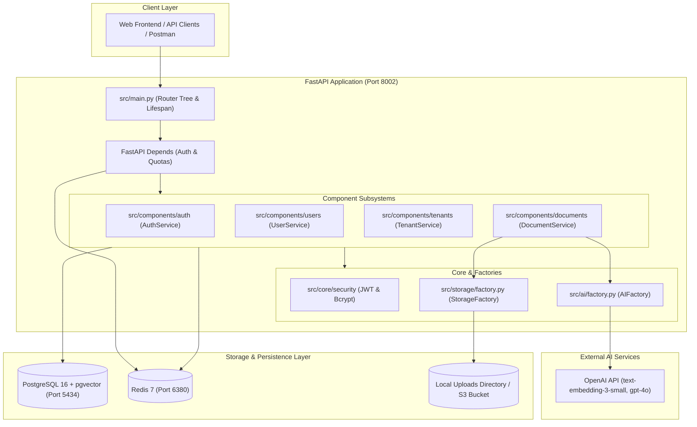

# RAG Engine Documentation Hub

Welcome to the comprehensive technical documentation for the **RAG Engine** repository. This document hub provides architectural overviews, deep dives into the Retrieval-Augmented Generation (RAG) pipeline, layer-by-layer request workflow guides, and developer handbooks.

---

## Documentation Index

| Guide | Description | Key Topics |
| :--- | :--- | :--- |
| [**1. Project Workflow Guide**](file:///c:/Users/admin/Documents/Backup/rag_engine/docs/workflow_api_models_router_repository_schema.md) | In-depth walkthrough of the API lifecycle and architectural layers | API Endpoints, Pydantic Schemas, FastAPI Routers, Business Services, Repositories, SQLAlchemy Models |
| [**2. RAG Workflow Guide**](file:///c:/Users/admin/Documents/Backup/rag_engine/docs/rag_workflow.md) | Step-by-step walkthrough of the ingestion and retrieval processes | Document Upload, Chunking, Embeddings, pgvector Storage, Semantic Search, Generation |
| [**3. Developer Guide**](file:///c:/Users/admin/Documents/Backup/rag_engine/docs/developer_guide.md) | Practical handbook for onboarding, local setup, and extending the codebase | Environment Setup, Docker, Database Migrations, Adding New Components, Testing & Debugging |
| [**4. RAG Architecture Guide**](file:///c:/Users/admin/Documents/Backup/rag_engine/docs/rag_architecture_guide.md) | Technical blueprint and engineering decisions behind RAG | `pgvector` Vector Store, AI Provider Factory, Chunking Strategies, Similarity Metrics, Multi-tenancy Isolation |
| [**5. Project Architecture Guide**](file:///c:/Users/admin/Documents/Backup/rag_engine/docs/project_architecture_guide.md) | System-level architecture, infrastructure, and core design patterns | Modular Monolith, Repository Pattern, Cache-Aside Pattern, RBAC Hierarchy, Redis Quotas |
| [**6. Environment & Free Deployment Guide**](file:///c:/Users/admin/Documents/Backup/rag_engine/docs/free_deployment_and_environment_guide.md) | Full .env variables reference & 100% free cloud deployment walkthrough | Environment Variables, Neon PostgreSQL with pgvector, Upstash Redis, Render.com Hosting |
| [**7. Zero-Cost Cloud Infrastructure Guide**](file:///c:/Users/admin/Documents/Backup/rag_engine/docs/free_cloud_databases_guide.md) | Complete setup guide for free cloud databases and services ($0/mo) | Neon.tech, Supabase (pgvector), Upstash Redis, Cloudflare R2 |
| [**8. Plans & Permissions Architecture Guide**](file:///c:/Users/admin/Documents/Backup/rag_engine/docs/plans_and_permissions_guide.md) | Public signup, plan limits, seat quotas, and dynamic API access matrix | Public External Admin Signup, Plan Seat Quotas, Allowed Roles, API Permission Matrix |

---


## High-Level System Architecture



---

## Tech Stack Overview

- **Framework**: [FastAPI](https://fastapi.tiangolo.com/) (Python 3.11+)
- **Server**: [Uvicorn](https://www.uvicorn.org/) (ASGI)
- **Database & ORM**: PostgreSQL 16 with [`pgvector`](https://github.com/pgvector/pgvector), [SQLAlchemy 2.0](https://www.sqlalchemy.org/) (Async with `asyncpg`)
- **Caching & Quota Rate Limiting**: [Redis 7](https://redis.io/) (`redis.asyncio`)
- **AI & RAG**: [OpenAI](https://platform.openai.com/), [LangChain Text Splitters](https://python.langchain.com/), [PyPDF](https://pypdf.readthedocs.io/)
- **File Storage**: Pluggable Local File Storage (`aiofiles`) and AWS S3 / MinIO (`aioboto3`)
- **Containerization**: [Docker](https://www.docker.com/) and [Docker Compose](file:///c:/Users/admin/Documents/Backup/rag_engine/docker-compose.yml)
- **Authentication**: OAuth2 Bearer Tokens (JWT via PyJWT) with Salted Passwords (Bcrypt)

---

## Project Structure Quick Reference

```text
rag_engine/
├── docs/                        # Project Documentation
│   ├── README.md                # Documentation Hub Index (this file)
│   ├── workflow_api_models_router_repository_schema.md
│   ├── rag_workflow.md
│   ├── developer_guide.md
│   ├── rag_architecture_guide.md
│   ├── project_architecture_guide.md
│   └── free_deployment_and_environment_guide.md
├── src/
│   ├── ai/                      # AI Provider Abstraction (Factory Pattern)
│   │   ├── factory.py           # AIFactory for selecting AI engines
│   │   ├── interfaces.py        # BaseAIProvider contract
│   │   └── providers/           # Concrete providers (OpenAI, etc.)
│   ├── components/              # Domain-Driven Modular Components
│   │   ├── auth/                # Login, OAuth2 password flow, JWT issuance
│   │   ├── documents/           # PDF upload, RAG vectorization, document metadata
│   │   ├── tenants/             # Multi-tenancy, workspaces, Redis daily quotas
│   │   └── users/               # User profiles, hierarchical RBAC, caching
│   ├── core/                    # Cross-cutting concerns
│   │   ├── config.py            # Pydantic Settings (.env configuration)
│   │   ├── database.py          # SQLAlchemy Async Engine and SessionLocal
│   │   ├── deps.py              # Auth and RBAC dependency injection
│   │   ├── permissions.py       # Role hierarchy definitions
│   │   ├── redis.py             # Shared async Redis client
│   │   └── security.py          # Bcrypt hashing and JWT encoding/decoding
│   ├── storage/                 # Storage Abstraction (Factory Pattern)
│   │   ├── factory.py           # StorageFactory for local vs S3 switching
│   │   ├── interfaces.py        # BaseStorageProvider contract
│   │   ├── local_storage.py     # Local filesystem async storage
│   │   └── s3_storage.py        # AWS S3 / MinIO async storage
│   └── main.py                  # FastAPI Application Factory, router aggregation, lifespan
├── uploads/                     # Local storage directory for uploaded assets
├── docker-compose.yml           # Multi-container orchestration (App, pgvector, Redis)
├── Dockerfile                   # App container build definition
└── requirements.txt             # Python dependencies
```
