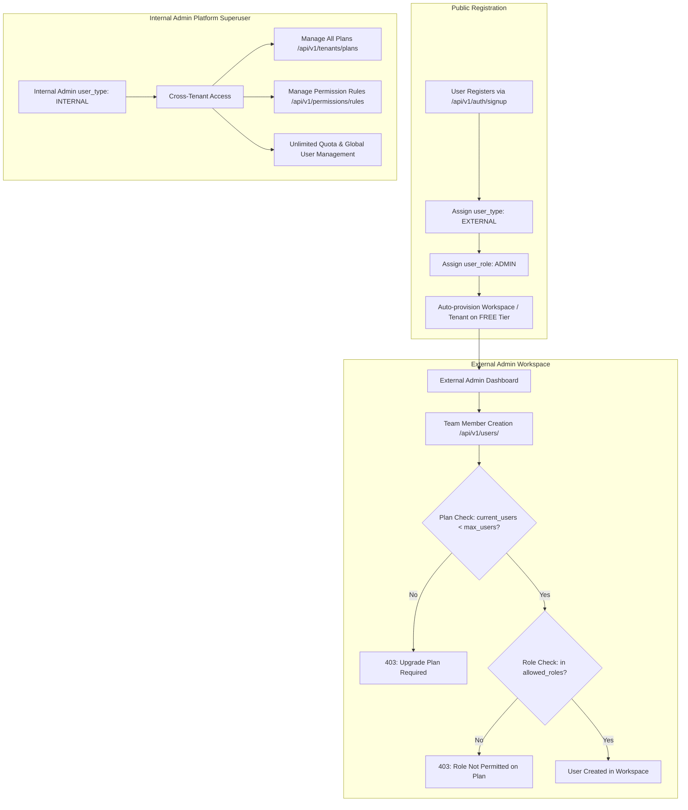

# Plans, User Roles & API Permissions Guide

## 1. Overview & System Architecture

This document describes the multi-tenant subscription plan and role-based access control (RBAC) architecture of the RAG Engine.



---

## 2. Public User Signup (`POST /api/v1/auth/signup`)

Every self-registered user is guaranteed the following attributes:
1. **`user_type`**: Always `external`
2. **`user_role`**: Always `admin` (they are the administrator of their organization/workspace)
3. **`user_status`**: Always `active`
4. **Workspace Auto-Provisioning**:
   - If `tenant_id` is omitted, the API automatically provisions a new `Tenant` workspace titled `{first_name}'s Workspace` (or custom `workspace_name` if passed).
   - The workspace starts on the **`free`** subscription tier (`SubscriptionTier.FREE`).
   - The newly created admin user is immediately assigned `tenant_id = new_tenant.id`.

### Request Example
```bash
POST /api/v1/auth/signup
Content-Type: application/json

{
  "email": "sarah@cyberdyne.com",
  "password": "StrongPassword123!",
  "first_name": "Sarah",
  "last_name": "Connor",
  "phone": "+1234567890",
  "gender": "female",
  "workspace_name": "Cyberdyne Systems"
}
```

### Response Example
```json
{
  "email": "sarah@cyberdyne.com",
  "first_name": "Sarah",
  "last_name": "Connor",
  "phone": "+1234567890",
  "gender": "female",
  "user_role": "admin",
  "user_type": "external",
  "user_status": "active",
  "id": 12,
  "tenant_id": 7,
  "created_by": null,
  "updated_by": null,
  "created_at": "2026-10-01T18:32:57Z",
  "updated_at": "2026-10-01T18:32:57Z"
}
```

---

## 3. Subscription Plans & Team Creation Quotas

Each workspace has a subscription tier defined in PostgreSQL table `plan_configs`:

| Tier | Plan Name | Max Users (`max_users`) | Daily Token Quota | Team Management | Allowed Creator Roles | Allowed Assignable Roles |
| :--- | :--- | :---: | :---: | :---: | :--- | :--- |
| **`free`** | Free Tier | **1** | 50,000 | ❌ Disabled | `admin` | `associate` |
| **`plus`** | Plus Tier | **5** | 250,000 | ✅ Enabled | `admin` | `associate,consultant` |
| **`pro`** | Pro Tier | **25** | 1,000,000 | ✅ Enabled | `admin,manager` | `associate,consultant,team_lead,manager` |
| **`max`** | Max Tier | **100** | 5,000,000 | ✅ Enabled | `admin,manager` | `associate,consultant,team_lead,manager,account_manager` |
| **`enterprise`** | Enterprise Tier | **10,000** | 999,999,999 | ✅ Enabled | `admin,maintainer,manager` | *All Roles* |

### Team Creation Rules for External Admins
When an External Admin calls `POST /api/v1/users/`:
1. **Creator Authorization**: The creator's role must be listed in `plan_config.team_creator_roles`.
2. **Workspace Seat Limit**: If active members in the workspace reach `plan_config.max_users`, the request is rejected with `HTTP 403 Forbidden`:
   ```json
   {
     "detail": "User limit reached (1/1 users) for Free Tier. Upgrade your plan to add more team members."
   }
   ```
3. **Role Validation**: If the external admin tries to assign a role not listed in `plan_config.allowed_roles`, it is rejected with `HTTP 403 Forbidden`:
   ```json
   {
     "detail": "Role 'vice_president' cannot be assigned on your Plus Tier plan. Permitted assignable roles: ['associate', 'consultant']"
   }
   ```
4. **Tenant Isolation**: The target user is automatically assigned `tenant_id = creator.tenant_id` and `user_type = EXTERNAL`. External admins cannot create internal users or add users to other workspaces.

### Workspace Seat Quota Endpoint
Frontends can render seat progress bars and dynamically populate role dropdowns by calling:
```http
GET /api/v1/tenants/my-workspace/user-quota
Authorization: Bearer <token>
```
**Response**:
```json
{
  "tenant_id": 7,
  "tenant_name": "Cyberdyne Systems",
  "tier": "plus",
  "plan_name": "Plus Tier",
  "max_users": 5,
  "current_users": 2,
  "remaining_slots": 3,
  "can_create_users": true,
  "allowed_roles_to_assign": ["associate", "consultant"],
  "team_creator_roles": ["admin"]
}
```

---

## 4. API & Feature Access Matrix (`api_permission_rules`)

API access is governed by the user's **Plan Tier** AND **User Role**.

### Database Table: `api_permission_rules`
- `id` (PK, Integer)
- `tier` (VARCHAR: `free`, `plus`, `pro`, `max`, `enterprise`, or `*`)
- `user_role` (VARCHAR: `admin`, `manager`, `associate`, etc., or `*`)
- `feature_code` (VARCHAR: e.g. `documents:upload`, `rag:query`, `users:create`)
- `is_allowed` (BOOLEAN)
- `description` (VARCHAR)

### Standard Feature Codes
- `documents:upload`: Upload PDF documents and embed vector representations
- `documents:read`: List and search workspace documents
- `documents:delete`: Remove documents and vectors
- `rag:query`: Ask questions and run RAG semantic completions
- `users:create`: Add new members to workspace
- `users:read`: View workspace members
- `users:update`: Edit member details
- `users:delete`: Deactivate workspace member
- `workspace:read`: Inspect workspace status
- `workspace:manage`: Modify workspace settings
- `analytics:read`: Inspect token usage and quotas

---

## 5. Endpoints Summary

### Authentication
- `POST /api/v1/auth/signup`: Public signup (always creates External Admin with Free workspace).
- `POST /api/v1/auth/login`: Exchange credentials for JWT access token.

### Permission & Access Control (Manageable by Internal Admin)
- `GET /api/v1/permissions/matrix`: View full Plan x Role x Feature access matrix.
- `GET /api/v1/permissions/my-access`: Returns logged-in user's permitted features, workspace limits, and capabilities.
- `GET /api/v1/permissions/rules`: List all permission rules in DB (Internal Admin only).
- `POST /api/v1/permissions/rules`: Create a permission rule in DB (Internal Admin only).
- `PATCH /api/v1/permissions/rules/{rule_id}`: Update a rule / toggle `is_allowed` (Internal Admin only).
- `DELETE /api/v1/permissions/rules/{rule_id}`: Delete a permission rule (Internal Admin only).
- `POST /api/v1/permissions/check`: Test/evaluate access for a tier, role, and feature code.

### Subscription Plan Configurations (Manageable by Internal Admin)
- `GET /api/v1/tenants/plans`: List all plans and limits (public).
- `GET /api/v1/tenants/plans/{tier}`: Get one plan config.
- `POST /api/v1/tenants/plans`: Create a new plan (Internal Admin only).
- `PATCH /api/v1/tenants/plans/{tier}`: Update `max_users`, `daily_token_quota`, `allowed_roles`, `team_creator_roles` (Internal Admin only).
- `GET /api/v1/tenants/my-workspace/user-quota`: Workspace seat quota & allowed assignable roles.

### Users Management
- `POST /api/v1/users/`: Create user (External Admin: enforced by plan quota and allowed roles; Internal Admin: unrestricted).
- `GET /api/v1/users/`: List users (External Admin: scoped strictly to own workspace; Internal Admin: all workspaces).
- `PATCH /api/v1/users/{user_id}`: Update member profile.
- `DELETE /api/v1/users/{user_id}`: Deactivate member account.
- `PATCH /api/v1/users/{user_id}/user-type`: Change between `internal` and `external` (Internal Admin only).

---

## 6. Internal Admin (Platform Superuser)

To create an Internal Admin with global rights across the entire system:
```bash
# On host machine
python scripts/create_internal_admin.py --email admin@platform.com --password SecretPassword123!

# Inside Docker
docker exec rag_engine_app python scripts/create_internal_admin.py --email admin@platform.com --password SecretPassword123!
```

Internal Admins bypass all plan limits, quota constraints, and multi-tenant scoping. They have full edit access over all workspaces, documents, users, plans, and permission rules.
