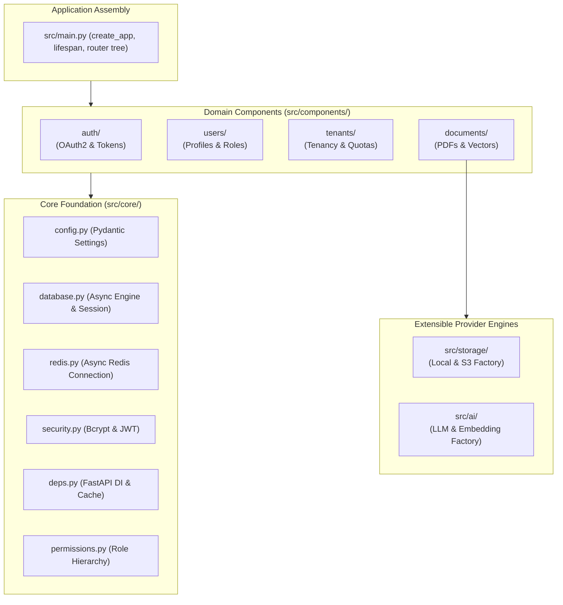
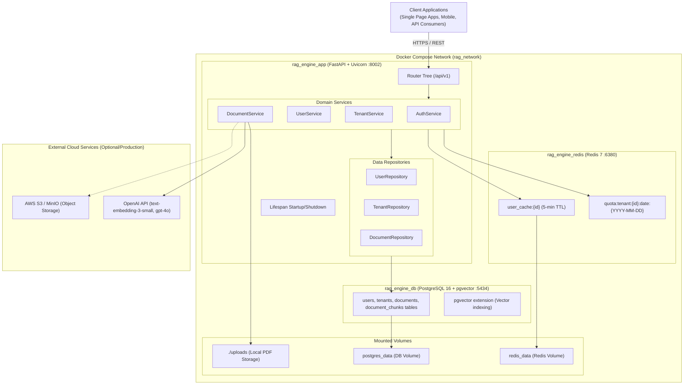
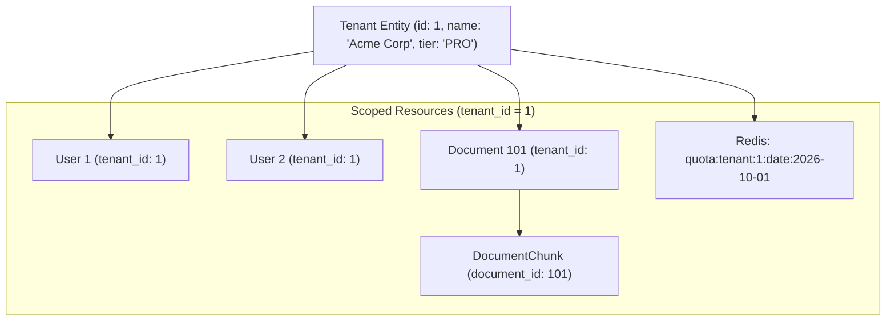
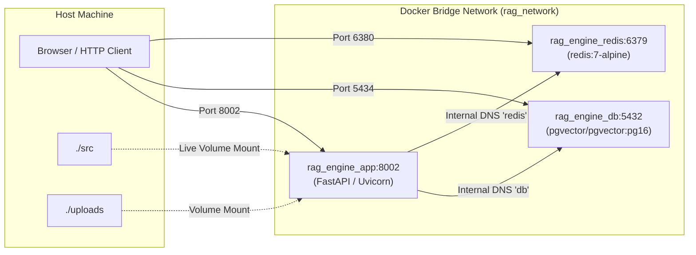

# Overall Project Architecture Guide

This document details the macro-level architecture of the **RAG Engine** system. It describes the structural design, core architectural patterns, security model, multi-tenancy isolation mechanisms, and infrastructure topology.

---

## 1. Architectural Philosophy: The Modular Monolith

The **RAG Engine** is structured as a **Modular Monolith**. Rather than decomposing early into microservices—which introduces distributed latency, network failures, and complex deployments—the codebase is organized into cleanly decoupled, domain-driven modules inside a unified FastAPI project:

### Advantages of This Design:
1. **Domain Boundary Isolation**: Each component (`auth`, `users`, `tenants`, `documents`) owns its own models, repositories, schemas, services, and endpoints.
2. **Zero In-Process Network Latency**: Cross-domain calls execute in-memory with zero network serialisation penalty.
3. **Microservices Ready**: If a domain (such as `documents` / RAG vector ingestion) requires dedicated auto-scaling in the future, its directory can be extracted directly into a standalone service without refactoring business logic.

---

## 2. Comprehensive System Architecture (C4 Container Diagram)

---

## 3. Core Architectural Patterns

### 3.1. Controller-Service-Repository Pattern
- **Router (Controller)**: Handles HTTP serialisation, validation, status codes, and routing.
- **Service**: Implements business rules, coordinates repositories, manages Redis caches and quotas, and triggers external APIs.
- **Repository**: Encapsulates all database queries and raw SQL/ORM interactions.
- **Model**: Represents database schema tables.

### 3.2. Factory Pattern for Storage & AI Providers
- Storage backends and AI engines are abstracted behind base interfaces ([`BaseStorageProvider`](file:///c:/Users/admin/Documents/Backup/rag_engine/src/storage/interfaces.py) and [`BaseAIProvider`](file:///c:/Users/admin/Documents/Backup/rag_engine/src/ai/interfaces.py)).
- Concrete classes ([`LocalFileStorageProvider`](file:///c:/Users/admin/Documents/Backup/rag_engine/src/storage/local_storage.py), [`S3StorageProvider`](file:///c:/Users/admin/Documents/Backup/rag_engine/src/storage/s3_storage.py), [`OpenAIProvider`](file:///c:/Users/admin/Documents/Backup/rag_engine/src/ai/providers/openai_provider.py)) are instantiated dynamically at runtime by [`StorageFactory`](file:///c:/Users/admin/Documents/Backup/rag_engine/src/storage/factory.py) and [`AIFactory`](file:///c:/Users/admin/Documents/Backup/rag_engine/src/ai/factory.py) according to `.env` configuration.

### 3.3. Cache-Aside Pattern with Proactive Eviction
- User authentication Lookups:
  - Cache Read: The authentication dependency [`get_current_user`](file:///c:/Users/admin/Documents/Backup/rag_engine/src/core/deps.py#L18-L77) checks Redis for `user_cache:{user_id}`.
  - Cache Miss: Fetches from PostgreSQL, serializes to JSON, and caches in Redis with a 300-second (5-minute) TTL.
  - Cache Eviction: Any update or deactivation on the user record ([`UserService.update_user`](file:///c:/Users/admin/Documents/Backup/rag_engine/src/components/users/service.py#L57-L77), [`UserService.deactivate_user`](file:///c:/Users/admin/Documents/Backup/rag_engine/src/components/users/service.py#L105-L121)) immediately executes `redis.delete(f"user_cache:{user_id}")` to guarantee consistency.

### 3.4. Daily Sliding Bucket Quota Pattern
- Quotas are maintained in Redis as atomic counters keyed by day: `quota:tenant:{tenant_id}:date:{YYYY-MM-DD}`.
- Incremented atomically via `redis.incr()`.
- Automatically expires after 24 hours (`redis.expire(key, 86400)`), saving memory and eliminating scheduled cron purge jobs.

---

## 4. Multi-Tenancy Architecture

The system implements a **Shared Database, Shared Schema with Discriminator Column** multi-tenancy model:

### Multi-Tenancy Guarantees:
1. **User Scoping**: Every user belongs to a `tenant_id`. Users cannot view or query documents outside their assigned workspace.
2. **Document & Vector Scoping**: All document queries and vector similarity searches explicitly join or filter by `WHERE Document.tenant_id = :current_user_tenant_id`.
3. **Subscription Tiers**:
   - `FREE`: 50 queries/day.
   - `PRO`: 1,000 queries/day.
   - `ENTERPRISE`: 999,999 queries/day.

---

## 5. Security & Authorization Architecture

### 5.1. Authentication (OAuth2 + JWT)
- Passwords hashed using standard salted **Bcrypt** (`src/core/security.py`).
- Tokens issued as standard **HMAC-SHA256 (HS256)** JWTs containing user ID claims (`sub`).
- Configurable token expiration (default: 7 days via `ACCESS_TOKEN_EXPIRE_MINUTES`).

### 5.2. Role-Based Access Control (RBAC) & Role Hierarchy
The system defines an 11-tier hierarchical role structure defined in [`src/core/permissions.py`](file:///c:/Users/admin/Documents/Backup/rag_engine/src/core/permissions.py):

| Role | Weight | Typical Permissions |
| :--- | :--- | :--- |
| `ADMIN` | 100 | Full system access, workspace provisioning, user deactivation |
| `MAINTAINER` | 90 | Administrative operations, system maintenance |
| `VICE_PRESIDENT` | 80 | Executive analytics and organizational oversight |
| `SENIOR_APPLICATION_MANAGER` | 70 | Application config and service orchestration |
| `APPLICATION_MANAGER` | 60 | Service-level monitoring and configuration |
| `SENIOR_ACCOUNT_MANAGER` | 50 | Enterprise account management |
| `ACCOUNT_MANAGER` | 40 | Account management and client coordination |
| `MANAGER` | 30 | Team management, user listing within workspace |
| `TEAM_LEAD` | 20 | Team-level document management and inspection |
| `CONSULTANT` | 10 | Standard read/write document operations |
| `ASSOCIATE` | 0 | Base employee role, standard RAG queries |

Endpoints can be guarded by:
- **Exact Role Sets**: `Depends(RequireRole([UserRole.ADMIN, UserRole.MAINTAINER]))`.
- **Minimum Role Weight**: `has_minimum_role(user.user_role, UserRole.MANAGER)`.

---

## 6. Infrastructure & Deployment Topology

The entire architecture is containerized and managed via [`docker-compose.yml`](file:///c:/Users/admin/Documents/Backup/rag_engine/docker-compose.yml):

- **Healthchecks**: PostgreSQL and Redis include automated container healthchecks (`pg_isready` and `redis-cli ping`), ensuring the FastAPI application container only starts once the backing stores are verified healthy.
- **Data Persistence**: Dedicated named volumes (`postgres_data`, `redis_data`) ensure zero data loss during container restarts or rebuilds.
