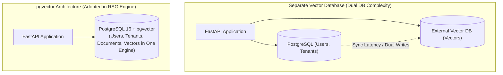
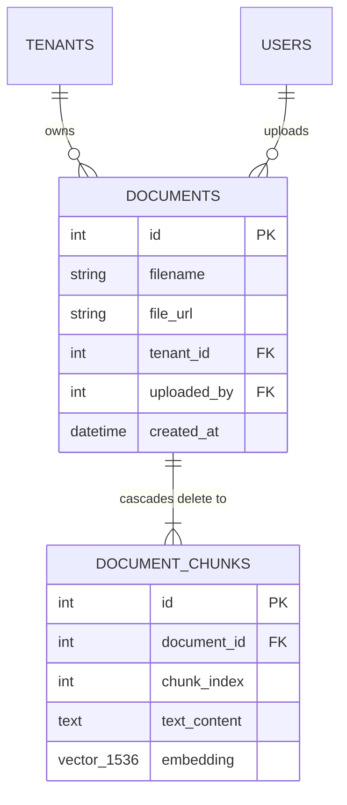
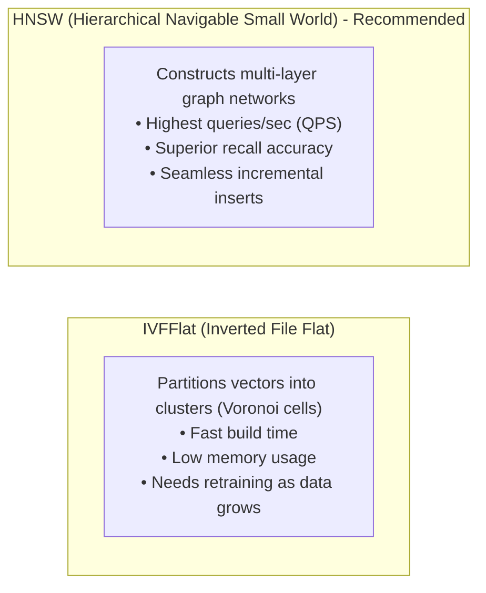
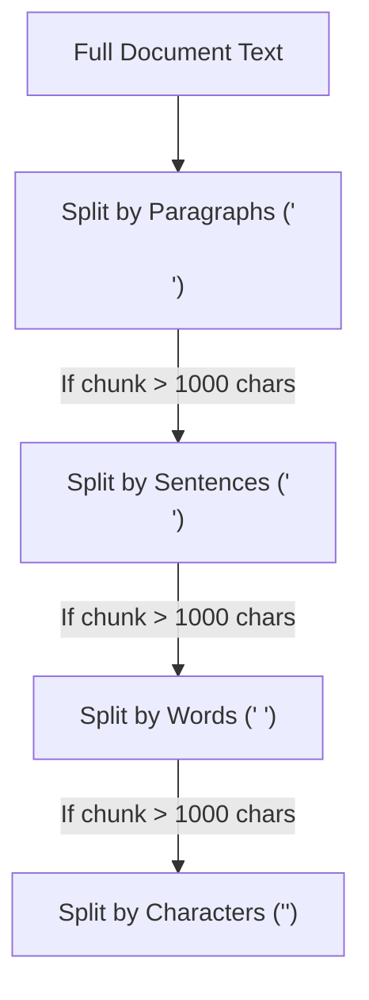
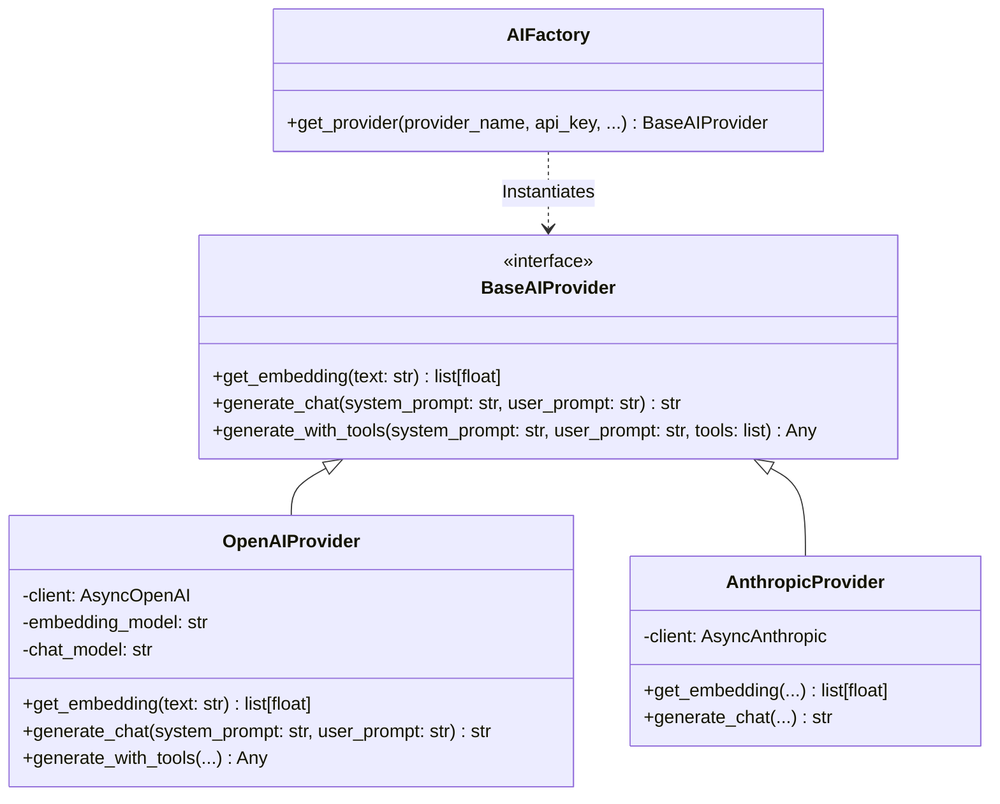

# RAG Architecture Guide

This guide details the technical blueprint, architectural decisions, and mathematical models underpinning the Retrieval-Augmented Generation (RAG) system in **RAG Engine**.

---

## 1. Architectural Principles

The RAG subsystem is engineered around four core tenets:

1. **Zero Data Leakage (Strict Multi-Tenancy)**: Documents and vector embeddings belonging to Workspace A must never be accessible or retrievable by Workspace B under any circumstance.
2. **ACID Relational Vector Co-location**: By utilizing `pgvector` inside PostgreSQL, relational metadata (tenants, users, document metadata) and high-dimensional vectors share the exact same database engine, eliminating distributed synchronization lag.
3. **Provider-Agnostic Abstraction**: AI models and file storage backends are decoupled behind abstract interfaces (`BaseAIProvider`, `BaseStorageProvider`) managed by runtime factories (`AIFactory`, `StorageFactory`).
4. **Resilient Quota Gating**: High-cost LLM generation and embedding calls are guarded by Redis atomic rate limits before compute or network resources are consumed.

---

## 2. Vector Storage Architecture: Why PostgreSQL & `pgvector`?

Modern RAG architectures often debate between standalone vector databases (Pinecone, Qdrant, Milvus, Weaviate) versus relational vector extensions. This system adopts **PostgreSQL with `pgvector`**.



### Architectural Benefits:
- **Transactional Consistency (ACID)**: If an ingestion batch fails, database rollback (`session.rollback()`) unifies document records and vector chunks cleanly. No orphan vectors in external stores.
- **Relational Joins & Hard Multi-Tenancy**: Vector search can be filtered directly via relational foreign key joins (`JOIN documents ON document_chunks.document_id = documents.id WHERE documents.tenant_id = :tenant_id`) within the query execution plan.
- **Cascade Deletions**: When a document or tenant is deleted, SQLAlchemy cascading deletes (`cascade="all, delete-orphan"`, `ondelete="CASCADE"`) instantly purge all associated vector chunks from disk.
- **Reduced Infrastructure Overhead**: Eliminates separate cluster management, API keys, and network hops to external vector cloud providers.

---

## 3. Database Schema Design for RAG

The RAG schema lives in [`src/components/documents/models.py`](file:///c:/Users/admin/Documents/Backup/rag_engine/src/components/documents/models.py):



### Key Schema Considerations:
- **`file_url`**: Stores the absolute local path (`/static/...`) or public S3 URL (`https://...`). Required (`nullable=False`).
- **`embedding`**: Defined as `Mapped[list[float]] = mapped_column(Vector(1536), nullable=False)`.
  - Dimensions: `1536` matches OpenAI `text-embedding-3-small`.
  - Storage format: Fixed-width binary float array for accelerated vector algebra.
- **Cascading Foreign Key**: `ForeignKey("documents.id", ondelete="CASCADE")` ensures physical chunks are deleted if the parent `Document` record is purged.

---

## 4. Vector Similarity Metrics & Indexing Strategies

### Distance Metrics

| Metric | Operator in pgvector | Formula | Optimal Use Case |
| :--- | :--- | :--- | :--- |
| **Cosine Distance** | `<=>` | $1 - \frac{u \cdot v}{\|u\|_2 \|v\|_2}$ | **Recommended for text embeddings** (normalizes for length differences) |
| **L2 Euclidean Distance** | `<->` | $\|u - v\|_2$ | Image embeddings, physical coordinates |
| **Negative Inner Product** | `<#>` | $-(u \cdot v)$ | Unnormalized vector similarity |

The RAG Engine uses **Cosine Distance** (`<=>`) for all semantic comparisons.

### Indexing: IVFFlat vs. HNSW

For production deployments with >50,000 document chunks, building an approximate nearest neighbor (ANN) index is required:



To create an HNSW index in production:
```sql
CREATE INDEX idx_chunks_embedding_hnsw 
ON document_chunks 
USING hnsw (embedding vector_cosine_ops)
WITH (m = 16, ef_construction = 64);
```

---

## 5. Chunking Strategy Deep Dive

A naive chunking strategy (e.g. splitting every 500 words blindly) cuts sentences and code blocks in half, destroying semantic context.

The RAG Engine utilizes **Recursive Character Chunking** via `langchain_text_splitters`:



### Parameter Tuning:
- **Chunk Size (1,000 characters)**: Provides enough context for LLMs to understand complex nuance (typically 150–250 tokens), fitting multiple chunks comfortably in the context window.
- **Chunk Overlap (200 characters)**: Ensures sentences that span across a chunk boundary appear in full in at least one chunk, preventing retrieval blind spots.

---

## 6. AI Provider Subsystem (`src/ai/`)

The AI layer follows the **Strategy & Factory Pattern**:



- [`BaseAIProvider`](file:///c:/Users/admin/Documents/Backup/rag_engine/src/ai/interfaces.py): Declares abstract methods for embeddings, chat generation, and future **Model Context Protocol (MCP)** tool execution (`generate_with_tools`).
- [`OpenAIProvider`](file:///c:/Users/admin/Documents/Backup/rag_engine/src/ai/providers/openai_provider.py): Concrete implementation using `AsyncOpenAI`. Default embedding model: `text-embedding-3-small`; default chat model: `gpt-4o`.
- [`AIFactory`](file:///c:/Users/admin/Documents/Backup/rag_engine/src/ai/factory.py): Reads provider name dynamically at runtime and instantiates the correct client.

---

## 7. Storage Provider Subsystem (`src/storage/`)

Documents are abstracted behind [`BaseStorageProvider`](file:///c:/Users/admin/Documents/Backup/rag_engine/src/storage/interfaces.py):

- **Local Storage** ([`LocalFileStorageProvider`](file:///c:/Users/admin/Documents/Backup/rag_engine/src/storage/local_storage.py)): Ideal for local development, air-gapped environments, and testing. Mounted at `/static` in [`src/main.py`](file:///c:/Users/admin/Documents/Backup/rag_engine/src/main.py#L88).
- **Cloud S3 Storage** ([`S3StorageProvider`](file:///c:/Users/admin/Documents/Backup/rag_engine/src/storage/s3_storage.py)): Async streaming via `aioboto3`. Fully compatible with AWS S3, Cloudflare R2, MinIO, or Google Cloud Storage.
- **Factory Switching**: Simply setting `STORAGE_BACKEND=s3` in `.env` reconfigures the entire storage pipeline without modifying application code.
