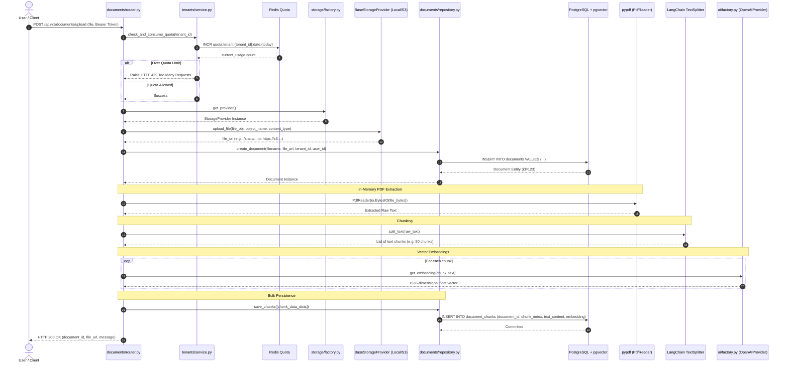
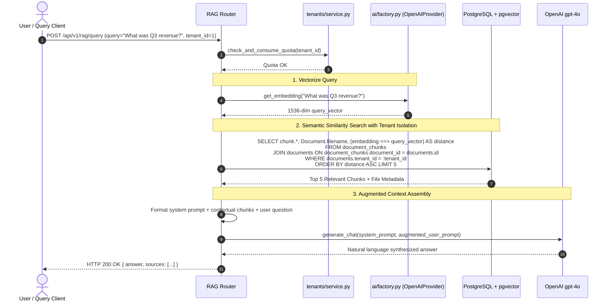

# RAG Workflow Guide

This document details the end-to-end **Retrieval-Augmented Generation (RAG)** pipeline implemented in the **RAG Engine**. It covers both the **Ingestion Pipeline** (document processing, chunking, embedding, vector storage) and the **Retrieval & Generation Pipeline** (query vectorization, similarity search, prompt synthesis, and LLM response generation).

---

## 1. High-Level RAG Architecture

```mermaid
graph TD
    subgraph IngestionPipeline ["A. Ingestion Pipeline (Write Path)"]
        UserPDF["Client uploads PDF"] --> UploadRouter["POST /api/v1/documents/upload"]
        UploadRouter --> QuotaCheck["Tenant Quota Check (Redis)"]
        QuotaCheck --> Storage["StorageProvider (Local / S3)"]
        Storage --> SaveDoc["Insert Document Record in DB"]
        SaveDoc --> ExtractText["Text Extraction (pypdf)"]
        ExtractText --> Splitter["Recursive Character Text Splitter"]
        Splitter --> EmbedChunks["Embedding Generation (OpenAI text-embedding-3-small)"]
        EmbedChunks --> BulkInsert["Bulk Insert into pgvector (DocumentChunk)"]
    end

    subgraph RetrievalPipeline ["B. Retrieval & Generation Pipeline (Read Path)"]
        UserQuery["Client submits query"] --> QueryRouter["POST /api/v1/rag/query"]
        QueryRouter --> QueryQuota["Tenant Quota Check (Redis)"]
        QueryQuota --> EmbedQuery["Vectorize Query (text-embedding-3-small)"]
        EmbedQuery --> VectorSearch["pgvector Cosine Similarity (<=>) + Tenant Filter"]
        VectorSearch --> AssembleContext["Context Synthesizer (Top-K Chunks)"]
        AssembleContext --> LLM["LLM Generation (gpt-4o)"]
        LLM --> FormattedResponse["Augmented Answer + Source Citations"]
    end
```



---

## 2. The Ingestion Pipeline (Step-by-Step)

The ingestion pipeline handles converting raw PDF documents into searchable high-dimensional vector representations while enforcing security boundaries and tenant quotas.



### Step 2.1: Quota Verification & Consumption
- Every document upload must consume against the tenant's daily quota.
- Handled in [`TenantService.check_and_consume_quota`](file:///c:/Users/admin/Documents/Backup/rag_engine/src/components/tenants/service.py#L34-L63).
- Uses a Redis atomic `INCR` operation on the key `quota:tenant:{tenant_id}:date:{YYYY-MM-DD}`.
- If the current count exceeds the tenant's [`SubscriptionTier`](file:///c:/Users/admin/Documents/Backup/rag_engine/src/components/tenants/models.py#L9-L13) limit (`FREE`: 50, `PRO`: 1000, `ENTERPRISE`: 999999), an HTTP `429 Too Many Requests` is raised immediately before reading or storing any data.

### Step 2.2: Physical Storage (Factory Pattern)
- Storage resolution is abstracted via [`StorageFactory.get_provider()`](file:///c:/Users/admin/Documents/Backup/rag_engine/src/storage/factory.py#L6-L21).
- Based on `STORAGE_BACKEND` in `.env`:
  - **Local Storage** ([`LocalFileStorageProvider`](file:///c:/Users/admin/Documents/Backup/rag_engine/src/storage/local_storage.py#L10-L32)): Asynchronously saves to disk using `aiofiles` under `uploads/tenant_{id}/{uuid}-{filename}` and returns `/static/tenant_{id}/{uuid}-{filename}`.
  - **AWS S3 / MinIO** ([`S3StorageProvider`](file:///c:/Users/admin/Documents/Backup/rag_engine/src/storage/s3_storage.py#L13-L54)): Streams asynchronously to an S3 bucket using `aioboto3` and returns the S3 URL.

### Step 2.3: Relational Metadata Record
- Creates the parent document record in PostgreSQL using [`DocumentRepository.create_document`](file:///c:/Users/admin/Documents/Backup/rag_engine/src/components/documents/repository.py#L13-L25):
  ```python
  doc = Document(
      filename=file.filename,
      file_url=file_url,
      tenant_id=tenant_id,
      uploaded_by=user_id,
  )
  ```
- This assigns an auto-incrementing `id` used to correlate all subsequent chunks.

### Step 2.4: Text Extraction & Chunking Strategy
- **PDF Extraction**: Uses [`pypdf.PdfReader`](https://pypdf.readthedocs.io/) to parse pages from in-memory bytes without requiring temporary disk files.
- **Recursive Character Splitting**: Employs `langchain_text_splitters.RecursiveCharacterTextSplitter`:
  - **Chunk Size**: `1000` characters.
  - **Chunk Overlap**: `200` characters (ensures semantic context across chunk boundaries is preserved).
  - **Separators**: Priority ordered: `["\n\n", "\n", " ", ""]`.

### Step 2.5: Vector Embedding Generation
- Text chunks are mapped to vector embeddings using [`OpenAIProvider.get_embedding`](file:///c:/Users/admin/Documents/Backup/rag_engine/src/ai/providers/openai_provider.py#L17-L21).
- **Model**: `text-embedding-3-small`.
- **Dimensions**: `1536` floating point numbers.
- **pgvector Column**: [`Vector(1536)`](file:///c:/Users/admin/Documents/Backup/rag_engine/src/components/documents/models.py#L43).

### Step 2.6: High-Performance Bulk Insertion
- Rather than inserting chunks one by one, [`DocumentRepository.save_chunks`](file:///c:/Users/admin/Documents/Backup/rag_engine/src/components/documents/repository.py#L27-L32) uses SQLAlchemy's `session.add_all()`:
  ```python
  chunks = [DocumentChunk(**data) for data in chunks_data]
  self.session.add_all(chunks)
  await self.session.commit()
  ```
- This ensures minimal roundtrips and high ingestion throughput even for 500+ page documents.

---

## 3. The Retrieval & Generation Pipeline (Step-by-Step)



### Step 3.1: Query Vectorization
- The user's query string is converted to an embedding using the identical model (`text-embedding-3-small`) used during ingestion to ensure coordinate space alignment.

### Step 3.2: Multi-Tenant Similarity Search (SQLAlchemy + pgvector)
- The search executes in PostgreSQL using `pgvector`'s cosine distance operator `<=>`:
  ```python
  stmt = (
      select(DocumentChunk, Document.filename)
      .join(Document, DocumentChunk.document_id == Document.id)
      .where(Document.tenant_id == current_user.tenant_id)
      .order_by(DocumentChunk.embedding.cosine_distance(query_vector))
      .limit(top_k)
  )
  ```
- **Strict Multi-Tenancy**: The `JOIN` to [`Document`](file:///c:/Users/admin/Documents/Backup/rag_engine/src/components/documents/models.py#L10-L29) and `WHERE Document.tenant_id == current_user.tenant_id` guarantees zero data leakage across different workspaces.

### Step 3.3: Context Window Budgeting & Prompt Synthesis
The retrieved chunks are formatted into a grounded prompt structure:

```text
You are an expert AI assistant. Answer the user's question using ONLY the provided document context below.
If the context does not contain the answer, say "I cannot find the answer in the provided documents."

DOCUMENT CONTEXT:
---
[Source: financial_report.pdf | Chunk: 4]
In Q3, consolidated revenue grew by 18% year-over-year reaching $4.2M...
---
[Source: annual_summary.pdf | Chunk: 12]
Net operating margin for the third quarter expanded to 24%...

USER QUESTION:
What was the revenue and operating margin in Q3?
```

### Step 3.4: LLM Generation with Citations
- The synthesized prompt is sent to `OpenAIProvider.generate_chat` using `gpt-4o`.
- The final response returns the synthesized answer alongside citation metadata:
  ```json
  {
    "answer": "In Q3, consolidated revenue was $4.2M (representing an 18% YoY growth), and net operating margin expanded to 24%.",
    "citations": [
      {
        "document_name": "financial_report.pdf",
        "document_id": 12,
        "chunk_index": 4,
        "similarity_score": 0.892
      }
    ]
  }
  ```
