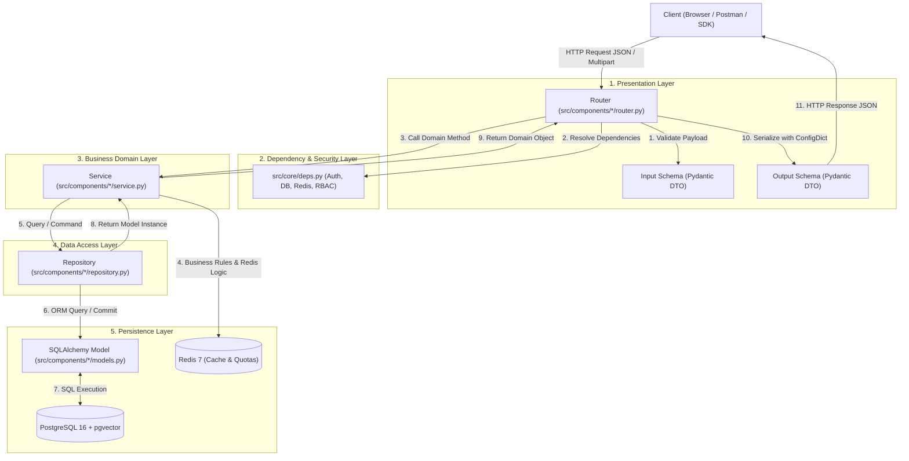
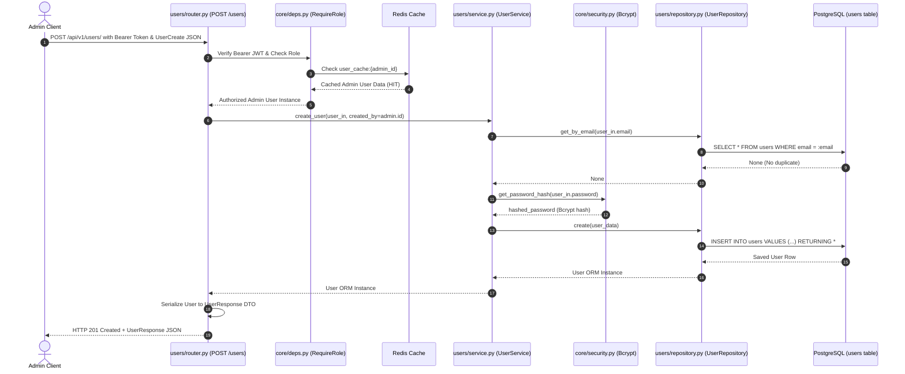

# API, Models, Router, Repository & Schema Workflow

This document provides a comprehensive breakdown of the architectural workflow implemented in the **RAG Engine**. It explains how requests travel through the system layers—from HTTP endpoints to database persistence—and details the exact roles of **Routers**, **Schemas**, **Services**, **Repositories**, and **Models**.

---

## 1. Architectural Overview: The 5-Layer Pattern

The application enforces a strict **Controller-Service-Repository** pattern with strongly-typed data contracts. Each layer has a single, isolated responsibility:

---

## 2. Responsibilities of Each Layer

### Layer 1: Pydantic Schemas (`schemas.py`)
- **Role**: Data Transfer Objects (DTOs) and Validation Contracts.
- **Input Validation**: Validates client requests before they hit any business logic. Rejects malformed types, missing required fields, or out-of-range strings automatically with HTTP 422.
- **Output Serialization**: Shapes the outgoing JSON payload. Protects sensitive fields (e.g. omitting `hashed_password` while exposing `id` and `email`).
- **ORM Conversion**: Uses `model_config = ConfigDict(from_attributes=True)` to convert SQLAlchemy ORM instances into Pydantic models automatically.
- **Source Code Locations**:
  - Auth: [`src/components/auth/schemas.py`](file:///c:/Users/admin/Documents/Backup/rag_engine/src/components/auth/schemas.py)
  - Users: [`src/components/users/schemas.py`](file:///c:/Users/admin/Documents/Backup/rag_engine/src/components/users/schemas.py)
  - Tenants: [`src/components/tenants/schemas.py`](file:///c:/Users/admin/Documents/Backup/rag_engine/src/components/tenants/schemas.py)
  - Documents: [`src/components/documents/schemas.py`](file:///c:/Users/admin/Documents/Backup/rag_engine/src/components/documents/schemas.py)

### Layer 2: API Routers (`router.py`)
- **Role**: HTTP Interface and Controller.
- **Routing**: Maps HTTP verbs (`GET`, `POST`, `PATCH`, `DELETE`) and URL paths.
- **Dependency Injection**: Uses FastAPI's `Depends()` to inject database sessions, Redis connections, authenticated user contexts, and services.
- **Guards**: Enforces Role-Based Access Control (RBAC) via dependencies like `RequireRole([UserRole.ADMIN])`.
- **Status Codes**: Declares appropriate HTTP status codes (e.g., `201 Created` for user registration, `200 OK`, `404 Not Found`).
- **Source Code Locations**:
  - Auth: [`src/components/auth/router.py`](file:///c:/Users/admin/Documents/Backup/rag_engine/src/components/auth/router.py)
  - Users: [`src/components/users/router.py`](file:///c:/Users/admin/Documents/Backup/rag_engine/src/components/users/router.py)
  - Tenants: [`src/components/tenants/router.py`](file:///c:/Users/admin/Documents/Backup/rag_engine/src/components/tenants/router.py)
  - Documents: [`src/components/documents/router.py`](file:///c:/Users/admin/Documents/Backup/rag_engine/src/components/documents/router.py)

### Layer 3: Services (`service.py`)
- **Role**: Business Logic & Orchestration.
- **Agnostic to HTTP**: Services know nothing about FastAPI `Request` objects or response formatting. They deal purely with domain objects and exceptions.
- **Business Rule Enforcement**:
  - Hashing passwords using Bcrypt before database creation.
  - Checking email uniqueness and raising HTTP 409 Conflict.
  - Verifying tenant subscription limits and incrementing daily Redis counters.
  - Invalidation of cached user records in Redis upon profile modification.
  - Interfacing with third-party storage (`StorageFactory`) and AI (`AIFactory`).
- **Source Code Locations**:
  - Auth: [`src/components/auth/service.py`](file:///c:/Users/admin/Documents/Backup/rag_engine/src/components/auth/service.py)
  - Users: [`src/components/users/service.py`](file:///c:/Users/admin/Documents/Backup/rag_engine/src/components/users/service.py)
  - Tenants: [`src/components/tenants/service.py`](file:///c:/Users/admin/Documents/Backup/rag_engine/src/components/tenants/service.py)
  - Documents: [`src/components/documents/service.py`](file:///c:/Users/admin/Documents/Backup/rag_engine/src/components/documents/service.py)

### Layer 4: Repositories (`repository.py`)
- **Role**: Database Access and Query Encapsulation.
- **Decoupled Persistence**: Contains all SQLAlchemy queries, raw filters, joins, pagination offsets, and transaction management (`session.commit()`, `session.refresh()`).
- **Query Optimization**: Implements bulk chunk insertion (`session.add_all`) and dynamic query building for filtering and search.
- **Multi-Tenancy Scoping**: Ensures queries are strictly bounded to `tenant_id` where applicable.
- **Source Code Locations**:
  - Users: [`src/components/users/repository.py`](file:///c:/Users/admin/Documents/Backup/rag_engine/src/components/users/repository.py)
  - Tenants: [`src/components/tenants/repository.py`](file:///c:/Users/admin/Documents/Backup/rag_engine/src/components/tenants/repository.py)
  - Documents: [`src/components/documents/repository.py`](file:///c:/Users/admin/Documents/Backup/rag_engine/src/components/documents/repository.py)

### Layer 5: Models (`models.py`)
- **Role**: Database Table Schema Definitions (SQLAlchemy 2.0).
- **Declarative Mappings**: Uses `Mapped[...]` and `mapped_column(...)` for static typing.
- **Table Relationships & Foreign Keys**: Maps parent-child relationships with cascading deletes (e.g. `Document` -> `DocumentChunk`).
- **Vector Columns**: Defines pgvector embeddings (`Vector(1536)`).
- **Source Code Locations**:
  - Users: [`src/components/users/models.py`](file:///c:/Users/admin/Documents/Backup/rag_engine/src/components/users/models.py)
  - Tenants: [`src/components/tenants/models.py`](file:///c:/Users/admin/Documents/Backup/rag_engine/src/components/tenants/models.py)
  - Documents: [`src/components/documents/models.py`](file:///c:/Users/admin/Documents/Backup/rag_engine/src/components/documents/models.py)

---

## 3. End-to-End Request Lifecycle Sequence

Here is the exact step-by-step sequence when an authenticated client creates a new user:

---

## 4. Component-by-Component Walkthrough

### 4.1. Auth Component (`src/components/auth/`)
- **Workflow**:
  1. Client sends `username` (email) and `password` via `OAuth2PasswordRequestForm` to `POST /api/v1/auth/login`.
  2. [`AuthService.authenticate_user`](file:///c:/Users/admin/Documents/Backup/rag_engine/src/components/auth/service.py#L12-L33) fetches user by email using [`UserRepository`](file:///c:/Users/admin/Documents/Backup/rag_engine/src/components/users/repository.py#L20-L24).
  3. [`verify_password`](file:///c:/Users/admin/Documents/Backup/rag_engine/src/core/security.py#L7-L11) checks the plain text against `hashed_password` using Bcrypt.
  4. Checks that the user status is `ACTIVE`.
  5. [`create_access_token`](file:///c:/Users/admin/Documents/Backup/rag_engine/src/core/security.py#L22-L37) creates a signed JWT with `{"sub": user_id, "exp": expiration}`.
  6. Returns [`Token`](file:///c:/Users/admin/Documents/Backup/rag_engine/src/components/auth/schemas.py#L4-L6) with `access_token` and `token_type: "bearer"`.

### 4.2. Users Component (`src/components/users/`)
- **Key Concepts**:
  - **Caching**: The authentication dependency [`get_current_user`](file:///c:/Users/admin/Documents/Backup/rag_engine/src/core/deps.py#L18-L77) checks Redis for `user_cache:{id}` with a 5-minute TTL.
  - **Cache Invalidation**: On [`UserService.update_user`](file:///c:/Users/admin/Documents/Backup/rag_engine/src/components/users/service.py#L57-L77) or [`UserService.deactivate_user`](file:///c:/Users/admin/Documents/Backup/rag_engine/src/components/users/service.py#L105-L121), the Redis key `user_cache:{user_id}` is proactively evicted.
  - **Soft Delete**: User accounts are marked with `user_status = UserStatus.DELETED` rather than physically deleted from PostgreSQL to maintain audit and document ownership integrity.

### 4.3. Tenants Component (`src/components/tenants/`)
- **Key Concepts**:
  - **Isolation**: Workspaces represent multi-tenant units. Users and documents reference `tenant_id`.
  - **Subscription Tiers**: `FREE` (50 queries/day), `PRO` (1,000 queries/day), and `ENTERPRISE` (unlimited).
  - **Atomic Quotas**: [`TenantService.check_and_consume_quota`](file:///c:/Users/admin/Documents/Backup/rag_engine/src/components/tenants/service.py#L34-L63) increments an atomic Redis counter `quota:tenant:{id}:date:{YYYY-MM-DD}`. If the counter exceeds the tier limit, it returns HTTP 429 Too Many Requests.

### 4.4. Documents Component (`src/components/documents/`)
- **Key Concepts**:
  - Handles PDF uploads, file storage abstraction, database persistence, and vector chunk preparation.
  - [`DocumentService.process_and_upload`](file:///c:/Users/admin/Documents/Backup/rag_engine/src/components/documents/service.py#L27-L65) calls [`StorageFactory.get_provider()`](file:///c:/Users/admin/Documents/Backup/rag_engine/src/storage/factory.py#L8-L21) to store the physical file, then calls [`DocumentRepository.create_document`](file:///c:/Users/admin/Documents/Backup/rag_engine/src/components/documents/repository.py#L13-L25) to store metadata.

---

## 5. API Endpoint Catalog

| Method | Path | Summary | Auth Required | Required Role / Permission |
| :--- | :--- | :--- | :--- | :--- |
| `POST` | `/api/v1/auth/login` | Authenticate and obtain JWT token | No | Public |
| `GET` | `/api/v1/users/me` | Get profile of authenticated user | Yes | Any Active User |
| `POST` | `/api/v1/users/` | Create a new user | Yes | `ADMIN`, `MAINTAINER` |
| `GET` | `/api/v1/users/` | List users with filters and pagination | Yes | `ADMIN`, `MAINTAINER`, `MANAGER` |
| `GET` | `/api/v1/users/{user_id}` | Retrieve specific user by ID | Yes | Any Active User |
| `PATCH` | `/api/v1/users/{user_id}` | Update user profile details | Yes | Any Active User (Self/Admin) |
| `DELETE` | `/api/v1/users/{user_id}` | Soft-deactivate a user | Yes | `ADMIN`, `MAINTAINER` |
| `POST` | `/api/v1/tenants/` | Create a new tenant workspace | Yes | `ADMIN` only |
| `GET` | `/api/v1/tenants/my-workspace`| View current user's workspace | Yes | Any user belonging to a tenant |
| `POST` | `/api/v1/documents/upload` | Upload & vectorize PDF document | Yes | User belonging to a tenant |
| `GET` | `/api/v1/documents/` | List tenant documents | Yes | User belonging to a tenant |
| `GET` | `/health` | Application healthcheck & env status | No | Public |
